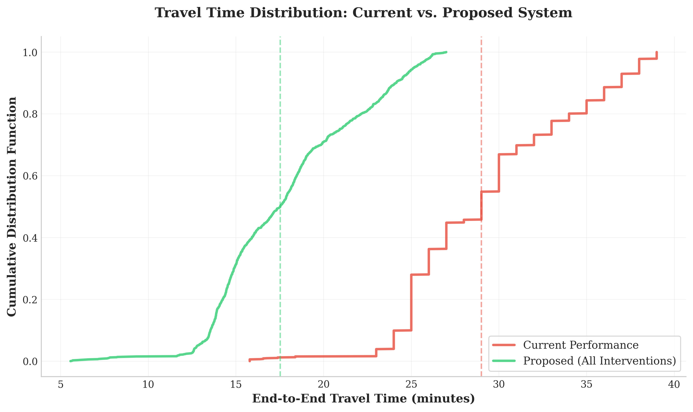
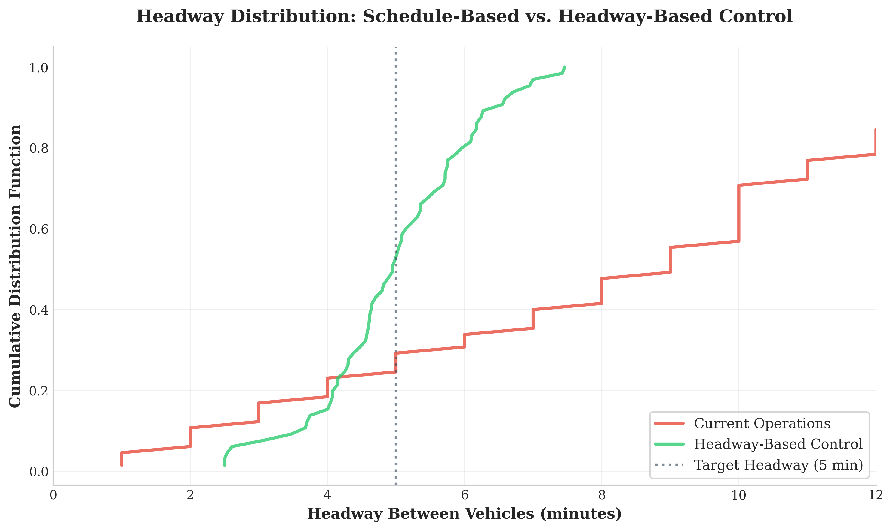
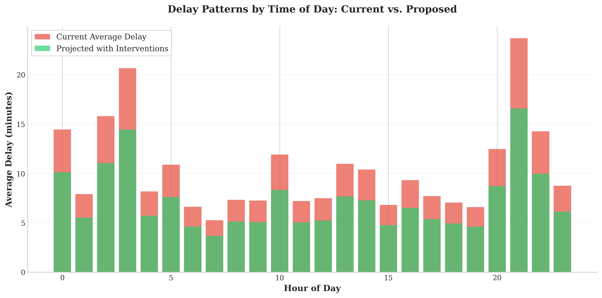

# 510 Spadina Improvement Model: Baseline Methodology

## Overview
This simulation model quantifies the cumulative impact of three proposed operational interventions on the 510 Spadina streetcar route:

Stop Consolidation - Reducing 5 stops.
Transit Signal Priority (TSP) - Implementing conditional signal priority
Headway-Based Operations - Shifting from schedule-based to headway-based control

The model uses an empirical perturbation approach, applying documented performance improvements from transit literature to observed baseline data from Toronto Transit Commission (TTC) operations.

## 1. Baseline Travel Time Calculation
- **Source:** TTC GTFS static data ([Link](https://open.toronto.ca/dataset/merged-gtfs-ttc-routes-and-schedules/))
- **Function:** `calculate_baseline_travel_times()`

This function extracts end-to-end travel times for the 510 route by processing scheduled trip sequences, providing the baseline required to assess stop spacing efficiency as per Furth & Rahbee (2000).

### Key Processes:
* **Time Normalization:** Converts GTFS timestamps (which often extend past 24:00:00 for late-night service) into absolute minute values for calculation.
* **Trip Filtering:**
  * Filters for valid `trip_id` sequences associated with the 510 route.
  * **Heuristic Validation:** Applies a domain-knowledge filter to exclude data artifacts. Only trips with durations between **15 and 45 minutes** are retained. This threshold removes depot moves or partial trips while capturing the variance of real-world operations (typical run time is ~29 mins).
* **Output:** Returns a NumPy array of valid travel times ($t$) for the simulation engine.
* **Execution Status:** The algorithm successfully extracted **1,267 valid trips** from the GTFS dataset, providing a robust distribution without requiring synthetic estimation.

## 2. Baseline Headway Analysis
- **Source:** TTC Delay Data (CSV format) ([Link](https://open.toronto.ca/dataset/ttc-streetcar-delay-data/)).
- **Function:** `calculate_baseline_headways()`

This function reconstructs the actual spacing between vehicles to quantify the "bunching" phenomenon and headway irregularity described in the critical review by Ansari Esfeh et al. (2020).

### Key Processes:
* **Time-Difference Calculation:** Sorts historical delay incidents by `DateTime` and calculates the delta ($\Delta t$) between consecutive log entries.
* **Noise Filtering:**
  * **Lower Bound (0.5 min):** Removes duplicate entries or simultaneous reports.
  * **Upper Bound (15 min):** Excludes major service gaps or prolonged disruptions that do not represent standard headway variance.
* **Data Fallback Logic (Waterfall):**
  1. **Primary:** Calculated time differences from raw timestamps.
  2. **Secondary:** If sample size $n < 50$, supplements with the `Min Gap` field provided in the delay logs.
  3. **Tertiary (Fail-safe - NOT USED):** If empirical data is insufficient, the code contains logic to generate a synthetic Gamma distribution ($\alpha=2, \beta=1.5$). **Note:** This fail-safe was not triggered in the final analysis; **966 empirical delay incidents** were successfully processed, rendering synthetic data generation unnecessary.

## Dependencies
* `pandas`: Data manipulation and time-series handling.
* `numpy`: Array operations for stochastic simulation.
* `datetime`: Parsing GTFS time strings.

## References
* Ansari Esfeh, M., Wirasinghe, S. C., Saidi, S., & Kattan, L. (2020). Waiting time and headway modelling for urban transit systems – a critical review and proposed approach. *Transport Reviews*, 41(2), 141–163. [https://doi.org/10.1080/01441647.2020.1806942](https://doi.org/10.1080/01441647.2020.1806942)
* Furth, P.G., & Rahbee, A.B. (2000). Optimal bus stop spacing through dynamic programming and geographic modeling. *Transportation Research Record*, 1731(1), 15-22. [https://doi.org/10.3141/1731-03](https://doi.org/10.3141/1731-03)
* Osuna, E. E., & Newell, G. F. (1972). Control strategies for an idealized public transportation system. *Transportation Science*, 6(1), 52–72. [https://doi.org/10.1287/trsc.6.1.52](https://doi.org/10.1287/trsc.6.1.52)

## Model Outputs
Below are the visual outputs generated by the simulation model, illustrating the projected improvements in travel time and headway regularity.

## Model Limitations

### Does Not Model:
* Real-time passenger demand fluctuations
* Weather impacts on dwell times
* Construction or special event disruptions
* Driver behavior variability

### Simplifications:
* Assumes perfect TSP implementation (no signal coordination failures)
* Ignores potential ridership changes from service improvements

### Data Constraints:
* Delay data may under-represent minor incidents
* GTFS represents scheduled times, not actual operations
* Limited temporal coverage (single year of data)

### Generalizability:
* Model calibrated specifically for 510 Spadina dedicated ROW
* Results not directly transferable to mixed-traffic routes
* Requires recalibration for other similar routes
